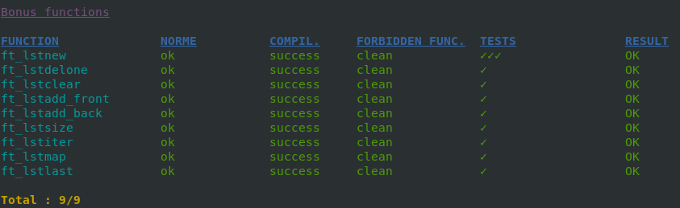

# 42 libft - Level 0
## Grade: 125/100
### Subject: [click here](extras/en.subject.pdf)

42 Common Core Libft project

This repository includes all the functions from the libft project from 42 Common Core (level 0). 
The goal was to create a library which would include C functions. 

### To run the project

1 - Clone the repository: 
` git clone https://github.com/maricard18/42_lvl0_libft.git`
2 - Navigate to the libft folder and run `make` 
`make` 
3 - You can run `make clean` to remove object files that are no longer needed. 
`make clean`  
4- Compile your main.c with your new libft.a  
`cc -Wall -Wextra -Werror main.c libft.a`  
5- And enjoy :) 

##Testing:
To tested if everyting was woring fine i ran two testers, wich results are posted below: 

#### [libft-war-machine](https://github.com/0x050f/libft-war-machine)  
  
  
  
